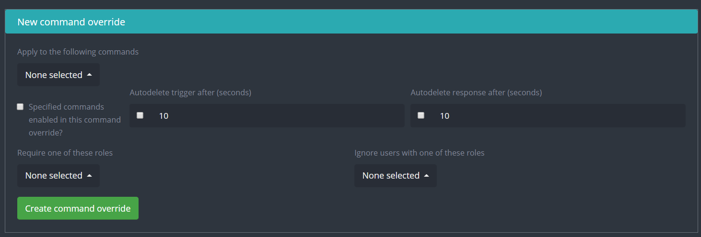

# Command Settings

## Prefix

The prefix is by default `-` The first thing you see when you open the command page is the prefix, you can replace this with your own unique prefix if you would like. Be sure to hit the save button afterwards. Only commands have a designated prefix.


**Flags and switches** are _not_ affected by prefixes. For example, if you were using the `rolemenu create` command with the prefix `+`, it would be`+rolemenu create (group name) -m (message id)`. Note that we used the `+` prefix but `-m` stayed as `-m`, not `+m`.


## Command Override

**Apply to the following commands:** Once you are in the box, you can select which command you want to override to apply to. __&#x20;

**Specific commands enabled in this command override:** You can then toggle whether or not to enable or disable the command with this override. (Enable this if you have the command disabled in the global settings)

**Auto delete trigger/response:** Toggle to enable/disable the auto delete for the trigger and response respectively and assign it a time to wait until deleting (1-60 Seconds).

**Require one of these roles:** Choose to require someone to have a role in order to use the commands.

**Ignore users with one of these roles:** Choose to ignore someone who has a role and prevent them from using the command.

## Channel Override

**Channels this override affects:** Select which channels you want the override to apply to.&#x20;

**Include current and future channels from the following categories:** By picking a category, you apply this override to all the channels in the category which includes future channels .

**Require one of these roles:** Choose to require someone to have a role in order to use the commands.

**Ignore users with one of these roles:** Choose to ignore someone who has a role and prevent them from using it.

**All commands enabled**: Enable all the commands for this override, you can create command override for the channel overrides below if you wish to customize further.

**Auto delete trigger/response:** Toggle to enable/disable the auto delete for the trigger and response respectively and assign it a time to wait until deleting (1-60 Seconds).

**New command override:** Create a command override that will apply to all the channels in the channel override. For help on creating command overrides, refer to [Command override.](commands.md#command-override)&#x20;
