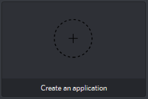

# Self Hosting with Docker



**This tutorial requires you to have little amount of knowledge regarding hosting websites and servers!**


## Getting started

To ensure that everything is set up, you first need to have docker and docker-compose installed. To install them run the following command:

```bash
sudo apt-get install -y docker docker-compose
```


You need to run this command as root, be sure to include the **sudo.**


Once you have docker installed, you need to get the files needed for the bot:

```bash
git clone https://github.com/jonas747/yagpdb
```

Once you cloned the files, you almost have everything you need.


As YAGPDB requires a web server, you should make sure that the ports 80 and 443 \(TCP\) are open and correctly [forwarded](https://portforward.com/).


## Setting up for the launch

First, you will have to move to the bot's directory and prepare the configuration files, for that you will need to run the following:

```bash
cd yagpdb/yagpdb_docker/
cp {app.example.env,app.env}
cp {db.example.env,db.env}
```


This is guaranteed to work on [BASH only](https://www.gnu.org/software/bash/manual/html_node/Shell-Parameter-Expansion.html), if you use a custom shell it may not work. 


#### Creating the bot

For the bot to be able to send messages and moderate your server, if first needs an account. To create one, go [here](https://discordapp.com/developers/applications/me).


Please make sure that you are logged in first.


If everything works well, this should appear, click the _"Create an application"_ button.



On the following screen you will be presented with multiple options:

* Name \(Bot name\)
* App description \(Anything you want\)


Make sure to save before switching to another category!


Then go to the Bot settings category. You will be asked if you want to create a bot. Press on _"Add Bot"_ and confirm it!

After doing that you will have more options to customize the bot and the bot token there.


Do not share the bot token at all costs, other users could do malicious actions with it and you will take all the responsibility for it.


Then go to OAuth2 and set the redirect URI's use the following:

* https://yagpdb.mywebsite.com/confirm\_login
* https://yagpdb.mywebsite.com/manage


Replace "yagpdb.mywebsite.com" with your hostname.


After you have entered everything you need, press _"Create App"._

#### Setting up the configuration

Now that you have the bot account ready, you need to make the configurations so the bot can use the account.

In the current folder, you should have at least four files. If any of the following are missing, try cloning the repository again and copying the examples into them.

* app.env
* db.env
* Dockerfile
* docker-compose.yml

First, we start by editing the app.env. To edit the file run the following command:

```bash
nano app.env
```


If you get the error "Command not found", try running `sudo apt-get install nano`

You may also use vi, but in this tutorial we use nano.


You will be presented with many options \(environment variables\), here is what they all mean and some examples:

| Variable | Requirement | Example | Meaning |
| :--- | :--- | :--- | :--- |
| YAGPDB\_OWNER | Required | 012345678901234567 | Discord ID of the bot owner |
| YAGPDB\_BOTID | Required | 012345678901234567 | Discord ID of the bot |
| YAGPDB\_CLIENTID | Required | 012345678901234567 | Client ID of the bot |
| YAGPDB\_CLIENTSECRET | Required | An4naSisAR4r3fruit\_A- | Client Secret of the bot |
| YAGPDB\_BOTTOKEN | Required | KDuj89nn8GBg77fUg8h | Bot token |
| YAGPDB\_HOST | Required | yagpdb.mywebsite.com | Website hostname |
| VIRTUAL\_HOST | Recommended | yagpdb.mywebsite.com | Website hostname |
| LETSENCRYPT\_HOST | Recommended | yagpdb.mywebsite.com | Website hostname |
| LETSENCRYPT\_EMAIL | Recommended | pandaguy@website.com | Your e-mail |
| YAGPDB\_EMAIL | Required | pandaguy@website.com | Your e-mail |
| YAGPDB\_PQHOST | Required | db | Container name of the database |
| YAGPDB\_PQUSERNAME | Required | yagpdb | Username of the database |
| YAGPDB\_PQPASSWORD | Required | GYuHF25Nt9yd2dh3 | Password of the database |
| YAGPDB\_REDIS | Required | redis:6379 | Docker container for redis |
| YAGPDB\_CONNEVT\_CHANNEL | Recommended | 012345678901234567 | Channel ID for gateway event reporting |
| YAGPDB\_CONNSTATUS\_CHANNEL | Recommended | 012345678901234567 | Channel ID for connection status reporting |
| YAGPDB\_BOTLEAVESJOINS | Recommended | 012345678901234567 | Channel ID for reporting joins/leaves |


Be sure to press Ctrl+O and save the file before exiting! It isn't saving automatically.



If you do not know how to get the values, check these links:

* [User/Channel IDs](https://support.discordapp.com/hc/en-us/articles/206346498-Where-can-I-find-my-User-Server-Message-ID-)
* [Bot Token](https://github.com/reactiflux/discord-irc/wiki/Creating-a-discord-bot-&-getting-a-token)


Going to the next configuration file, the db.env. This one is a quick one!

To open it, do the same as with the first configuration file.

```bash
nano db.env
```

You will be presented with three options:

| Variable | Variable in app.env | Example | Meaning |
| :--- | :--- | :--- | :--- |
| POSTGRES\_DB | none | yagpdb | Name of the database |
| POSTGRES\_USER | YAGPDB\_PQUSERNAME | yagpdb | Username for the database |
| POSTGRES\_PASSWORD | YAGPDB\_PQPASSWORD | Uf7b6vjojrs | Password for the database |


Use the same values as the app.env or the bot will not work properly!



The `POSTGRES_DB` value must be always `yagpdb`


## Building the bot

Great, you are now done with the configuration. The bot should be ready!

Building the bot is not required unless you want to customize the bot's functionality.



## Running the bot

To start the bot, run the following:

```bash
docker-compose up -d
```


This process could take a while, **be patient** and wait until it is finished!


### Shutting the bot down

To shut the bot down, run the following:

```text
docker-compose down 
```

### List all running docker containers

```text
docker ps
```

## Troubleshooting

Having trouble, here are the most common problems and fixes.

#### Bot is online but you cannot access the control panel?

1. Make sure that the ports 80 and 443 are open in the firewall
2. Make sure that you have [port forwarded](https://portforward.com/) them correctly
3. Check if you have any other services that may interfere

If it is still not working, open your **docker-compose.yml** and set the ports to the following:

```javascript
    ports:
      - "80:80"
      - "443:443"
```

#### I run multiple web servers and I want to run the bot through a reverse proxy

For that, we need to set up the bot to work with the reverse proxy.



For nginx users, you need first to set up the bot so it uses http only on the local side and change the port it is running on.

#### Dockerfile \(build only\)

Change `ENV external_tls ""` to `ENV external_tls "-https=false"`

#### Docker-compose

Uncomment `- "80:80"` and change it to your desired port _\(not required if the proxy runs on the same docker network\)_

Set the `command` key to the following:

```yaml
command: [ "-all", "-pa", "-exthttps=true", "-https=false" ]
```

#### Nginx configuration


For this configuration to work, we recommend using Certbot


```bash
server {

    server_name yagpdb.MYDOMAIN.COM;
    listen 443 ssl;
    ssl_certificate /var/certs/origin.pem; # Change this
    ssl_certificate_key /var/certs/private.key; # Change this
    error_log /var/log/nginx/yagpdb_error.log;
    access_log /var/log/nginx/yagpdb_access.log;

    location / {
        # Basic settings
        proxy_read_timeout 360s;
        proxy_http_version 1.1;
        
        # Change PORT to the port you've set in the previous step
        proxy_pass http://localhost:PORT;
        proxy_redirect http://localhost:PORT https://$server_name;

        # Headers
        proxy_set_header Host $http_host;
        proxy_set_header X-Real-IP $remote_addr;
        proxy_set_header X-Forwarded-Proto $scheme;
        proxy_set_header X-Forwarded-For $proxy_add_x_forwarded_for;
        proxy_set_header X-Content-Type-Options nosniff;
        proxy_set_header X-Frame-Options "DENY";
        proxy_set_header Referrer-Policy "strict-origin";
    }
}
```



So far, we have nothing here. If you have a method and want to submit it, join the support server and ping **caskd\#6769** or **Michdi\#1602**



## Hosting the bot on DigitalOcean

Here I will cover how you can set up the bot on DigitalOcean. You can also do this elsewhere, but I recommend using it. You pay $5 per month, but if you charge your account with $5, we can give you $25 credits.

First, you go to [digitalocean.com](https://m.do.co/c/ea8f09d701f9)¹, where you register. When you have done that, you have to add a payment method. You can either do this by using a credit card or by using PayPal. If you use PayPal, you always need enough credits on your account. If you don't have enough credits left, your server will be deleted. When you have a payment method to your account, you should be able to see the dashboard, where you can create a new droplet. A simple $5 droplet with 1GB RAM and 1 vCPU is enough for the bot to run on multiple servers \(50 - 200 servers, depending on the usage and size of the servers\). If you want another $15 for your DigitalOcean account, just click on Settings and Billing and enter the following promo code: **LOWENDBOX.** __After this process, you should have a minimum of $30 / $25 credits on your account \(10$ for registration, $15 for using the promo code and 5$ from adding a payment method \(if you used PayPal\).

When everything is set up, you can connect to the server using SSH \(either with an SSH Key \(recommended\) or with a password for root\) with your terminal \(macOS and Linux\) or putty \(Windows\). You can get the IP address of your droplet on the DigitalOcean dashboard. 

When connected to the server with SSH, you can start setting up the bot by using this tutorial. Make sure that a domain is pointed onto your droplet. If not, you can host a free domain on [freenom.com](http://www.freenom.com/en/index.html?lang=en) although I do not recommend this for high traffic. The domain should be pointed to DigitalOcean's nameservers: ns1.digitalocean.com, ns2.digitalocean.com and, ns3.digitalocean.com. On your DigitalOcean dashboard, you can add this domain and add a subdomain, which can be later used in the bot. 

Your bot should now be running. If you have any trouble running the bot, have a look at the [Troubleshooting Page](https://docs.yagpdb.xyz/~/edit/primary/other/self-hosting-with-docker#troubleshooting). If this still doesn't fix your error, join the support server and ask for assistance.

¹This is a referral link which gives you $10 on use. Also, this gives me \( **Jonas747\#0001**\) $25 once you spend more than $25 on DigitalOcean. You don't have to use this, but keep in mind that it also gives you $10 on signup and it would help support the bot!

## Updating the bot to a newer version

Updating the bot is pretty easy:



All you have to do is to pull the latest image from the [Docker Hub](https://hub.docker.com/r/caskd/yagpdb)

```bash
docker pull caskd/yagpdb:latest ## This will pull the latest proxy image (no SSL/TLS)
```

Afterwards you can just restart the bot and it will use the pulled image

```bash
docker-compose up -d
```


The compose command needs to be run in the `yagpdb_docker` directory or using the `-f config/path/file.yml` flag. See [Compose command line reference](https://docs.docker.com/compose/reference/up/).




1. Change directory to the bot's docker directory \(yagpdb\_docker\)
2. Run `docker-compose down`
3. Clone the latest version from GitHub by running `git pull https://github.com/jonas747/yagpdb`
4. Build the bot with `docker-compose build` 
5. Compose up with `docker-compose up -d`


Some updates may break the bot. Make sure you always know how to restore a change or make a backup instead!



If you change any files of the bot other than the folder `yagpdb_docker` make sure to commit them so you don't have any conflicts on update!




