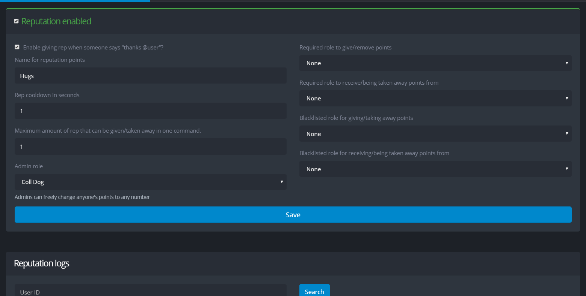

# Reputation

## Setup

Reputation is not enabled by default. To enable it, please go to the [control panel](https://yagpdb.xyz/manage) and check _Reputation enabled._

#### Enable giving rep when someone says "thanks @user"?

This is an alternative way of `-giverep`.

#### Name for reputation points

This will be displayed in the `-rep` command. On default, it is _Rep_.

#### Rep cooldown in seconds

This is the cooldown for the `-giverep` and `-takerep` commands. It does not affect the `-setrep` command. No one can bypass this cooldown, including admins.

####  Maximum amount of rep that can be given/taken away in one command

This affects the `-giverep` and `-takrep` commands which users can choose to specify the number of points to be given/taken away.

#### Admin role

Users with this role have access to the `-setrep` command and can freely change anyone's points to any number.

#### Required role to give/remove points

Users with this role have access to the `-giverep` and `-takerep` commands which is affected by the _Rep cooldown in seconds_ and the _Maximum amount of rep that can be given/taken away in one command_. If set to none, everyone will be able to use these commands.

#### Required role to receive/being taken away points from

Users with this role participates in the point system which they can be given/taken away points from. If set to none, everyone will be participating.

#### Blacklisted role for giving/taking away points

Users with this role cannot use the `-giverep` and `-takerep` commands. This also overides the _Required role to give/remove points._

#### Blacklisted role for receiving/being taken away points from

Users with this role cannot cannot participate in the point system which they can be given/taken away points from. This also overides the _Required role to receive/being taken away points from_.

## Reputation logs

Besides using the command `-replog` , you can also check the logs from the control panel. Specify a user ID to check the logs affecting the points of the user. See [How to get IDs](../other-1/templates.md#how-to-get-ids) to get more information on getting the user ID.

## Reset all users' reputation

This command is irreversible, and will reset everyone's reputation point to 0.

