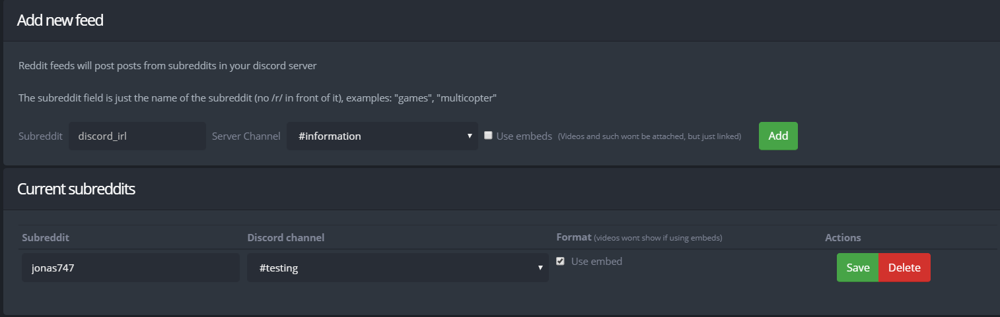

# Reddit Feed

## Reddit Feed

To get notifications from a subreddit page, simply enter the name of the subreddit in the subreddit field \(Without the /r/\). Then specify which channel you would like the bot to post the feed in.

You can toggle whether or not to post using embeds. The feed will look nicer but videos and such will not be attached but just linked

