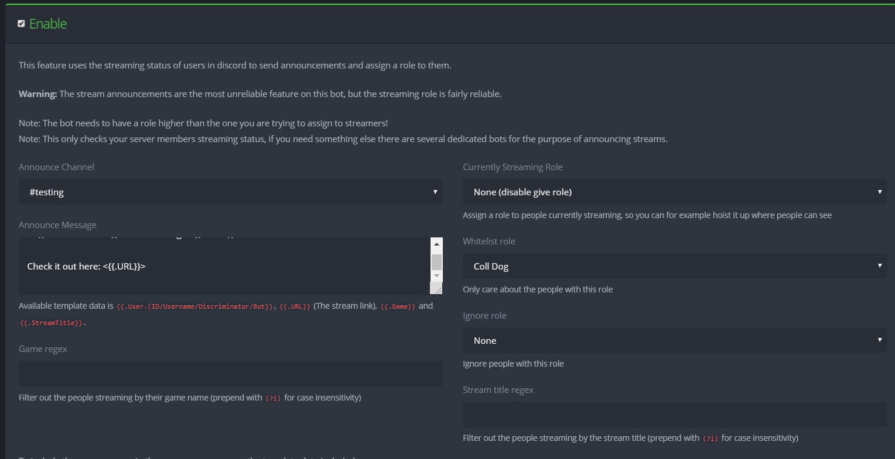

# Streaming Feed

### Streaming Feed


There is currently some issues with the streaming announcement and it may not always give the announcement. It will however, always assign the streamer role. 


Steaming notification goes off base on your Discord streaming status \(When you go purple, AKA steaming\). You can either have announcements, just be assigned the streaming role or both. 

### **Announce Channel**

Choose the Channel that you want to bot to post the announcement in.

### Announcement Message

Write the message that you want to announcement to say. The streaming announcements accept most [templates](../reference/templates.md), but have some additional special templates:

* `{{ .URL }}` outputs the URL of the stream.
* `{{ .Game }}` outputs the current game.
* `{{ .StreamTitle }}` outputs the stream title.
* `{{ .User.Username }}` outputs the Discord username of the person who is streaming.

### Game Regex

Use [regex ](../reference/regex.md)to filter out games to post announcements and assign roles for specific games.

### Currently Streaming Role

Assign this role to the people streaming. 

### Whitelist role

Only assign a role and make announcement for the people with this role.

### Ignore role

Do not assign a role and make a announcement for people with this role. 

### Stream Title Regex

Use [regex ](../reference/regex.md)to filter out streams base on the title of their stream

