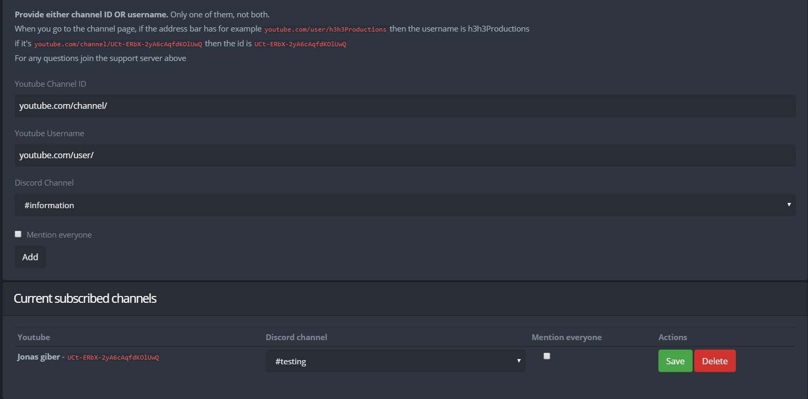

# Youtube Feed

## Youtube Feed


Do **NOT** fill in both the Channel ID and the Channel URL.

* There may be up to 5-15 minutes of delay for the bot to announce the video after it gets posted.


To get notifications from a YouTube channel, simply go to the YouTuber's channel and input either the ID or the Username in their respective field of the followings:

* Youtube Channel ID&#x20;
* Youtube Channel Username

If your channel looks like this  `youtube.com/user/h3h3Productions` then you would go into the username line and type in h3h3Productions.\
If your channel looks like this   `youtube.com/channel/UCt-ERbX-2yA6cAqfdKOlUwQ` then you would go into the ID line and type in UCt-ERbX-2yA6cAqfdKOlUwQ.

You can change the channel that the notifications are posted to via the dropdown menu.

You can also mention everyone by clicking the checkbox under the dropdown menu that says Mention everyone.
