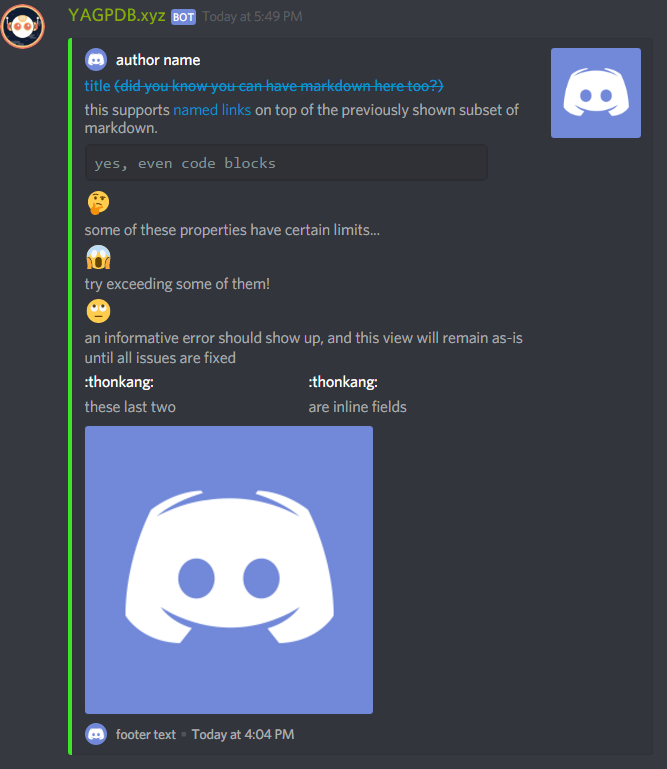
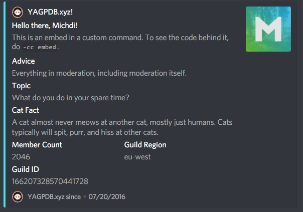

# Custom Embeds


Custom Embeds with the -customembed command don't work in custom commands. If you want to know how you can use embeds in custom commands, scroll down to [Embeds in Custom Commands](https://docs.yagpdb.xyz/custom-embeds#embeds-in-custom-commands).


## The `customembed` command

You always send an embed with YAGPDB by using the command `customembed` \(or for short, `ce`\). 

### Create embeds by hand

YAGPDB accepts embeds in json following the rules of [this format](https://discordapp.com/developers/docs/resources/channel#embed-object). 

There, we'll take a look at the **Embed Objects**. You can add a value to each of these objects. A very simple embed would look like this:

```javascript
{ "title": "This is my title", "description": "This is my description." }
```

The output of this would look like the following:


Let's break this down: We start of with the customembed-command `-ce`. After this, I start my object \(the embed\) with a curly brace. Then we have the name of the object \(title\) and the value of it \(This is my title\). We separate data with commas. After that we have the same thing again, but for the description. In the end we close the object \(embed\) with another curly brace.

You can add the multiple objects to this, but keep in mind that Discord limits your message to 2000 characters. 

#### The syntax of JSON

The syntax of json is pretty easy. You start off with a curly brace \(`{`\) and end with a curly brace \(`}`\). Between this, you can add names and their according values. Data \(a name and a value\) get separated by commas \(`,`\) . Around strings \(text\) you wrap two quotation marks \(`""`\), but nothing around integers \(whole numbers\) or booleans \(true or false statements\). You can play around with this a bit.

| Special character | Escaped output |
| :--- | :--- |
| Quotation mark \("\) | \" |
| Backslash \(\\) | \\ |
| Slash \(/\) | \/ |
| Backspace | \b |
| Form feed | \f |
| New line | \n |
| Carriage return | \r |
| Horizontal tab | \t |

### Create embeds with a generator

Creating embeds with a generator can be more difficult if you don't need any difficult features. If you want your embed to be super shiny, you can use[ this embed generator](https://leovoel.github.io/embed-visualizer/). YAGPDB does not use the first part of its code, so you have to remove the following: 

```javascript
{
  "content": "this `supports` __a__ **subset** *of* ~~markdown~~ 😃 ```js\nfunction foo(bar) {\n  console.log(bar);\n}\n\nfoo(1);```",
  "embed": 
```

and the last curly brace \(`}`\). After this you can just copy and paste it into Discord:



## Embeds in Custom Commands


Embeds in custom commands are a little more difficult. Also, there is no generator that you could use for this. **Please only proceed if you know about custom commands and templating in general.**


To start off, we'll take a look at this example and break it down:

```go
{{ $embed := cembed "title" "This is my title" "description" "This is my description." }}
{{ sendMessage nil $embed }}
```

First off, I start creating my embed by defining it in a variable called `embed` in the well-known templating curly braces. This makes it a bit clearer as your embed can get difficult to read. After this I start my embed object with `cembed` \(custom embed\) to indicate what the following strings mean. We don't follow the json syntax here and only define everything one after the other \("`name`" "`value`" et cetera\). Now we use the objects for discord embeds from the [developer page](https://discordapp.com/developers/docs/resources/channel#embed-object) again. So far, so good. In the end we send our embed with the sendMessage template. `nil` sends it in the same channel, but you could also replace it with a channel name or ID \(or send the embed with sendDM as a direct message\). 

Next, we'll take a look at this more lavish example:


If you try to copy and paste this command you will fail as I added line breaks to make it a bit clearer. You can find the whole command to copy and paste at the end of this page.



```go
{{ $advice := (execAdmin "advice") }}
{{ $topic := (execAdmin "topic") }}
{{ $catfact := (execAdmin "catfact") }}
{{ $avatar := (joinStr "" "https://cdn.discordapp.com/avatars/" (toString .User.ID) "/" .User.Avatar ".png") }}

{{$embed := cembed 
"title" (joinStr "" "Hello there, "  .User.Username "!") 
"description" "This is an embed in a custom command. To see the code behind it, do `-cc embed`." 
"color" 4645612 
"fields" (cslice 
    (sdict "name" "Advice" "value" $advice "inline" false) 
    (sdict "name" "Topic" "value" $topic "inline" false) 
    (sdict "name" "Cat Fact" "value" $catfact "inline" false) 
    (sdict "name" "Member Count" "value" (toString .Guild.MemberCount) "inline" true) 
    (sdict "name" "Guild Region" "value" .Guild.Region "inline" true) 
    (sdict "name" "Guild ID" "value" (toString .Guild.ID) "inline" true)) 
"author" (sdict "name" "YAGPDB.xyz!" "url" "https://yagpdb.xyz/manage" "icon_url" "https://cdn.discordapp.com/avatars/204255221017214977/a1f1318a1127b054bfffdeecaece5f15.png") 
"thumbnail" (sdict "url" $avatar) 
"footer" (sdict "text" "YAGPDB.xyz since" "icon_url" "https://cdn.discordapp.com/avatars/204255221017214977/a1f1318a1127b054bfffdeecaece5f15.png") 
"timestamp" .Guild.JoinedAt  }}

{{ sendMessage nil $embed }}
```


In this example, we can ignore lines 1 to 4. I'm just defining some variables there which I am later using in my embed. Line 6 starts with our already known definition of the embed. Then I start with the first object, the title. Notice how I use `joinStr` to join two strings \(text snippets\) together. This is the case because I want to use the `.User.Username` template. cembed takes Strings, so it would convert `{{ .User.Username }}` into {{ .User.Username }} instead of the username of the user. The syntax of `joinStr` is `joinStr "seperator" "string1" "string2"...`, so we're first setting the separator to nothing and then joining our strings "Hello there, ", the username and an exclamation mark.  
Next, we have the description. We can use markdown of Discord in here. After that object, I define the color. The color is given as integer and you can convert a hex color to it [here](https://www.binaryhexconverter.com/hex-to-decimal-converter).

Up next, I have added some fields. This is a bit more difficult, but doable if you have understood it once. Let's break it down in this example:

```go
"fields" (cslice 
    (sdict "name" "Title of field 1" "value" "Description of field 1" "inline" false) 
    (sdict "name" "Title of field 2" "value" "Description of field 2" "inline" false) 
```

This would add two fields being displayed under each other. If you set inline to true, they would try to get displayed next to each other. You can add multiple fields with sdict.

Following the fields I have added the author. Again the author object is nested and can have up to four fields. For this, we use sdict again. I define the name, the url and the icon url for it. The same applies to the avatar and footer. In the end I use `.Guild.JoinedAt` as timestamp to display when the first person joined this server and close the template. After this we just have to send the embed using `SendMessage` or `SendDM`. Here is our result:



If you want to copy this custom command, you can get it from here:


```go
{{ $advice := (execAdmin "advice") }}
{{ $topic := (execAdmin "topic") }}
{{ $catfact := (execAdmin "catfact") }}
{{ $avatar := (joinStr "" "https://cdn.discordapp.com/avatars/" (toString .User.ID) "/" .User.Avatar ".png") }}
{{ $embed := cembed "title" (joinStr "" "Hello there, "  .User.Username "!") "description" "This is an embed in a custom command. To see the code behind it, do `-cc embed`." "color" 4645612 "fields" (cslice (sdict "name" "Advice" "value" $advice "inline" false) (sdict "name" "Topic" "value" $topic "inline" false) (sdict "name" "Cat Fact" "value" $catfact "inline" false) (sdict "name" "Member Count" "value" (toString .Guild.MemberCount) "inline" true) (sdict "name" "Guild Region" "value" .Guild.Region "inline" true) (sdict "name" "Guild ID" "value" (toString .Guild.ID) "inline" true)) "author" (sdict "name" "YAGPDB.xyz!" "url" "https://yagpdb.xyz/manage" "icon_url" "https://cdn.discordapp.com/avatars/204255221017214977/a1f1318a1127b054bfffdeecaece5f15.png") "thumbnail" (sdict "url" $avatar) "footer" (sdict "text" "YAGPDB.xyz since" "icon_url" "https://cdn.discordapp.com/avatars/204255221017214977/a1f1318a1127b054bfffdeecaece5f15.png") "timestamp" .Guild.JoinedAt  }}
{{ sendMessage nil $embed }}
```


### Display an image 

You can display an image by simply pasting the link to it in the response, or by doing it fancy this way:  
\(make sure to replace the link with your own image ;\)\)

Trigger type: command trigger: `imageembed`

```go
{{ $embed := cembed "image" (sdict "url" "https://i.imgur.com/ttIwOmn.png")  }}
{{ sendMessage nil $embed }}
```

### Using colors

Discord uses color decimal. SpyColor is a good tool to pick colors, or convert hex to decimal.




## The `simpleembed` command

Simple embeds are easier to use than custom embeds as they do not require any knowledge of json. Their downside is that they don't support all Discord embed fields from the embed structure, for example fields. You can create a simple embed with the `simpleembed` command, `se` for short.

Simple embeds work with switches, here is a list of them all:

| Switch | Description |
| :--- | :--- |
| -channel | Optional channel to send in. |
| -title | Title field. |
| -desc | Description field. |
| -color | Color field, either in hex or a color name. |
| -url | URL field for embed. |
| -thumbnail | URL to an image for thumbnail field. |
| -image | URL to an image. |
| -author | Author field. |
| -authoricon | URL for the icon in 'author' field. |
| -footer | Footer field. |
| -footericon | URL to an image for footer icon field. |

The values for simple embeds need to bet placed within quotes:

```go
-se -title "This is my title" -desc "This is my description" -thumbnail "https://via.placeholder.com/300/"
```

This generates the following embed:


You can play around with this command a bit, it's really easy to use. 


Simple embeds can be used in custom commands:

`{{execAdmin "se" "-desc" "This is my description"}}` 


