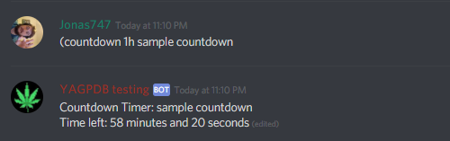
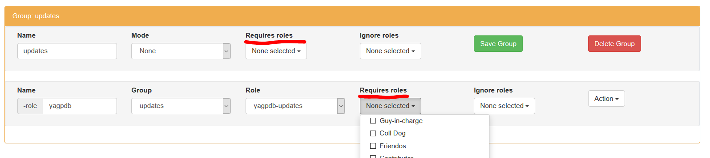

# Frequent Searches

## How do I invite YAGPDB to my server?

Go to [yagpdb.xyz](https://yagpdb.xyz/), click on **Add to server** and follow the instructions on your screen. Afterwards, you can start managing it there by selecting the server from the dropdown in the top right corner.&#x20;

## Why isn't YAGPDB responding to anything?

1. **Make sure you're using the right prefix** \
   Type `@YAGPDB.xyz#8760 prefix`. If YAGPDB responds with a different prefix from what you are currently using, you are using the wrong prefix. You can change it on the [control panel](https://yagpdb.xyz/manage).\

2. **Check that YAGPDB has permissions** \
   Check the channel settings to see if YAGPDB has read and write permissions for the channel. **Please double check this**, this is the most common reason why YAGPDB isn't responding. \

3. &#x20;**Ensure YAGPDB is visibly online**\
   Make sure that YAGPDB is online - [Discord might be having issues](https://status.discordapp.com/) or YAGPDB might be restarting (see [#downtime-announcements](https://discordapp.com/channels/166207328570441728/465887983657287686) in the Discord server).\

4. **Check your command settings** \
   If none of this works, make sure that all YAGPDB commands are enabled by visiting the [control panel](https://yagpdb.xyz/), logging in and selecting your server, clicking on **Core** and **Command Settings**. Make sure that **All commands enabled?** is checked and that there are no command overrides blocking the commands.

If you still have an issue, then you can contact us at our [support server](https://discordapp.com/invite/0vYlUK2XBKldPSMY).&#x20;

## What is the prefix and how do I change it?

The prefix is what the bot responds to for commands. The default prefix is `-` (a dash). To change the prefix, do the following steps.

1\. Visit the [control panel](https://yagpdb.xyz/manage)\
2\. Log in with your Discord account\
3\. Select your server\
4\. Click on **Core**\
5\. Click on **Command Settings**\
****6. Change the prefix in the text box and click on **Save all Settings**

## How do I set up role menus/role reactions/self-assignable roles?

There are multiple guides for this. These are our picks: \
**Video:** [**https://www.youtube.com/watch?v=IaTfJ4vqHhc**](https://www.youtube.com/watch?v=IaTfJ4vqHhc)\
**Documentation (Text):** [https://docs.yagpdb.xyz/self-assignable-roles](https://docs.yagpdb.xyz/self-assignable-roles)&#x20;

If you are still having difficulties setting up a role menu, you should read / watch the guide again. If you still can't figure it out, you can ask specific questions in #help. Questions if someone can set it up for you will be ignored.&#x20;

**Tips:**

* Make sure you that you don't set _Required Role_ to the role you want to assign.
* You can create role menus on your own message, read [this](https://docs.yagpdb.xyz/self-assignable-roles#custom-message) if you want to know how.

## Bot responds with "Missing a required role" when I try to use my rolemenu

This is a mistake many people make. Go back to the control panel and make sure that no role command/group has set a **required role.** If one role is set, set it to none:

## Why is the bot not giving the role when I use the role command?

The bot can only assign roles that are below it in the role hierarchy, check that the bot's highest role is above the role you wish to assign.

## How do I unban people?

You can unban people through Discord. YAGPDB also has an `unban` command. You can also use `-ban <user> -d 1s`- it "bans" for 1 second and unbans, effectively unbanning a given user. Be careful with this, as latter is a "hack" / workaround and not our real `unban` command.

## How do I enable developer mode?

Go to Settings -> Advanced and click the developer mode slider.

