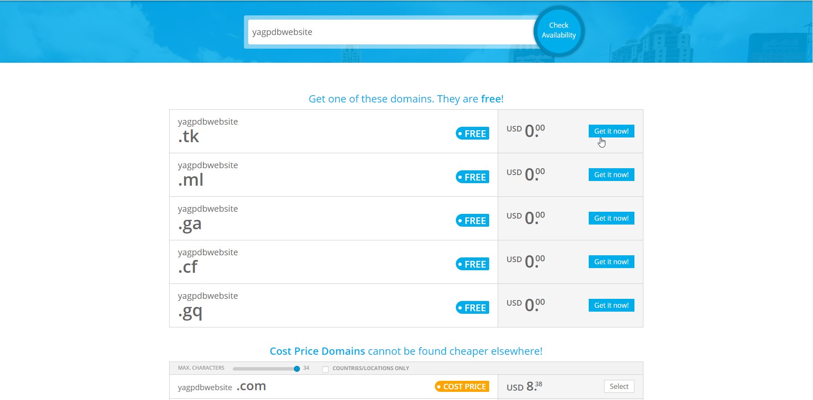
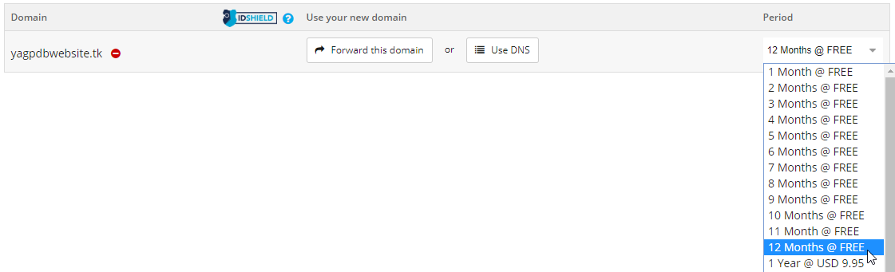

# Self Hosting the Website


## Setting up the website 

After, you have already configured the bot, you need to configure the website for the control panel otherwise it won't work. 


 You are going to need a domain for the website to work. This guide is going to be using [www.freenom.com](http://www.freenom.com/en/index.html?lang=en) as the host of the domain since it's free for 12 months and DigitalOcean as the host. It's not advised to use freenom if you will have a heavy amount of traffic. 


### Creating the domain 

First, you need to go to [http://www.freenom.com/en/index.html?lang=en](http://www.freenom.com/en/index.html?lang=en) and sign up. 

Then, go to services, click Register a New Domain, and enter the domain name you want. After, you've entered your domain name choose one of the free domains, click Get it now, then checkout. 




After that, change the Period to 12 months @ FREE and continue. 



Then, you need to fill in your details, agree to the terms & conditions, and complete the order.

### Pointing the domain towards your host's nameservers


If you are going to be using Cloudflare add the 2 nameservers that are provided by Cloudflare instead of DigitalOcean. 


 In client area click Services, My Domains, then Manage Domain. 

After, hover your mouse over Management Tools, click Nameservers, then click Use custom nameservers. 


If you are not using DigitalOcean as your host the nameservers are going to be different. 


Next, you need to add DigitalOcean's 3 nameservers and save it by clicking change nameservers. 

1. NS1.DIGITALOCEAN.COM
2. NS2.DIGITALOCEAN.COM
3. NS3.DIGITALOCEAN.COM

### Adding your domain to the DigitalOcean Dashboard

First, on the DigitalOcean Dashboard head over to Networking and enter your domain. 

Next, select your droplet and add the domain. 

### Configuring the website

First, you need to shutdown the bot. Run the following commands:

```text
cd yagpdb/yagpdb_docker
docker-compose down 
```

Next, you need to go to the configuration files that you are going to change by running:

```text
cd yagpdb/cmd/yagpdb
```

After, we are going to edit the sampleenvfile. Run the command to edit the file:

```text
nano sampleenvfile
```

You will be presented with many options \(environment variables\), here is what they all mean and some examples:


They will be the same as your app.env file.


| Variable | Requirements | Example  | Meaning |
| :--- | :--- | :--- | :--- |
| export YAGPDB\_OWNER | Required | 012345678901234567 | Discord ID of the bot owner |
| export YAGPDB\_BOTID | Required | 012345678901234567 | Discord ID of the bot |
| export YAGPDB\_CLIENTID | Required | 012345678901234567 | Client ID of the bot |
| export YAGPDB\_CLIENTSECRET | Required | An4naSisAR4r3fruit\_A- | Client Secret of the bot |
| export YAGPDB\_BOTTOKEN | Required | Bot KDuj89nn8GBg77fUg8h | Bot token |
| export YAGPDB\_HOST | Required | yagpdbwebsite.tk | Website hostname |
| export YAGPDB\_EMAIL | Required | pandaguy@website.com | Your e-mail |
| export YAGPDB\_PQHOST | Required | db | Container name of the database |
| export YAGPDB\_PQUSERNAME | Required | yagpdb | Username of the database |
| export YAGPDB\_PQPASSWORD | Required | GYuHF25Nt9yd2dh3 | Password of the database |
| export YAGPDB\_REDIS | Required | redis:6379 | Docker container for redis |
| export YAGPDB\_TESTING | Optional |  | Testing option |
| export YAGPDB\_MAIN\_SERVER | Recommended | 166207328970540728 | Main Bot server |
| export YAGPDB\_ADMIN\_ROLE | Optional |  | Full admin access |
| export YAGPDB\_READONLY\_ACCESS\_ROLE | Optional |  | Read only access |
| export YAGPDB\_CONNEVT\_CHANNEL | Recommended | 012345678901234567 | Discord gateway connection events channel  |


**Be sure to press Ctrl+O and save the file before exiting! It doesn't save automatically.**


### Re-building the bot

Next, we need to head to the bot's directory. Run the command:

```text
cd yagpdb/yagpdb_docker
```

Last, we need to re-build the bot using the following command:

```text
docker-compose up -d --build
```

