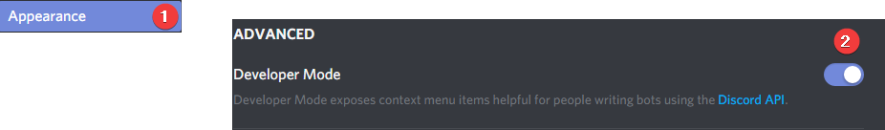

# Frequent Searches

## How do I invite YAGPDB.xyz to my server?

Go to [yagpdb.xyz](https://yagpdb.xyz/), click on **Add to server** and follow the instructions on your screen. Afterwards you can start managing it there by selecting the server from the dropdown in the top right corner. 

## Why isn't YAGPDB.xyz responding to anything?

1.  Type `@YAGPDB.xyz#8760 ping`. If YAGPDB responds, you have set it to a different prefix. You can change it on the [control panel](https://yagpdb.xyz/manage).
2.  Check the channel settings to see if YAGPDB.xyz has writing and reading permissions for the channel. **Please double check this**, this is the most common reason why YAGPDB isn't responding. 
3.  Make sure that YAGPDB.xyz is online, [Discord might be having issues](https://status.discordapp.com/), or YAGPDB.xyz might be restarting \(see \#downtime-announcements\).
4.  If none of this works, make sure that all YAGPDB commands are enabled by visiting the [control panel](https://yagpdb.xyz/), logging in and selecting your server, clicking on **Commands** and **Command Settings**. Make sure that **All commands enabled?** is checked and that there are no command overrides blocking the commands.

If you still have issue, then you can contact us at our support server. 

## What is the prefix and how do I change it?

 The default prefix is `-` \(dash\). To change the prefix, do the following steps.

1. Visit the [control panel](https://yagpdb.xyz/manage)  
2. Log in with your Discord account  
3. Select your server  
4. Click on **Commands**  
5. Click on **Command Settings**  
6. Change the prefix in the textbox and click on **Save all Settings**

## How do I set up role menus/role reactions/self-assignable roles?

There are multiple guides for this. These are our picks:   
Video: [https://youtu.be/icAqiw6txRQ](https://youtu.be/icAqiw6txRQ)   
Documentation \(Text\): [https://docs.yagpdb.xyz/self-assignable-roles](https://docs.yagpdb.xyz/self-assignable-roles) 

If you are still having difficulties setting up a role menu, you should read / watch the guide again. If you still can't figure it out, you can ask specific questions in \#help. Questions if someone can set it up for you will be ignored. 

Tips:   
• Make sure you that you don't set _Required Role_ to the role you want to assign.  
• You can create role menus on your own message, read [this](https://docs.yagpdb.xyz/self-assignable-roles#custom-message) if you want to know how.

## The bot says ~~~~_missing a required role_ when I use my role menu.

This is a mistake many people make. Go back to the control panel and make sure that no role/group has set a **required role.** If one role is set, set it to none:

## Why am I able to kick/ban someone higher than me with the bot?

If you have the correct permission \(Kick/Ban\) or the correct role. The bot will kick indiscriminately. Meaning, the bot does not care about your role hierarchy as long as the bot itself has the power to do the kick/ban. It is advised that you place all the roles the bot has below those of your staff.

## Why is the bot not giving the role when I use the role command?

The bot can only assign roles that are below it, double check where the bot role is on the list and where the role you are assigning is. 

## How do I unban people?

You can unban people through Discord. YAGPDB does not offer any further commands for this.

## How do I enable developer mode?

Go to Settings -&gt; Appearances and click the developer mode button

## How can I bookmark the control panel or documentation page?

Follow these steps here:



