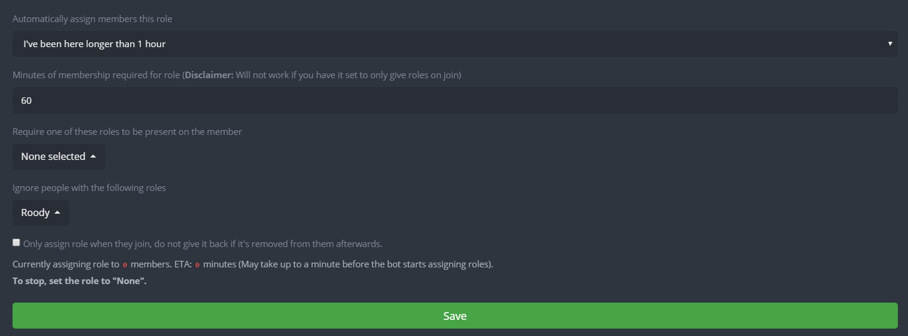

# Autorole


Make sure that the bot has permission to manage roles **and** that the role the bot is assigning is below the highest role the bot has. 


The different parameters you can set up on this site are:

* **Automatically assign members this role**: Select the role that you want to bot to auto assign \(only one role can be auto assigned\).
* **Minutes of membership required for role**: Requires that a member must be on the server for `x` minutes before assigning the role. 
* **Require one of these roles to be present on the member**: If a person does not have one of the following roles on them they will not be given a role. 
* **Ignore people with the following roles**: If a person has one of the following roles on them they will not be given a role.
* **Only assign role when they join, do not give it back if it's removed from them afterwards**: Only assign the role to them once when they joined. If they lose the role sometime after, the bot will not give it back to them.

\*\*\*\*

