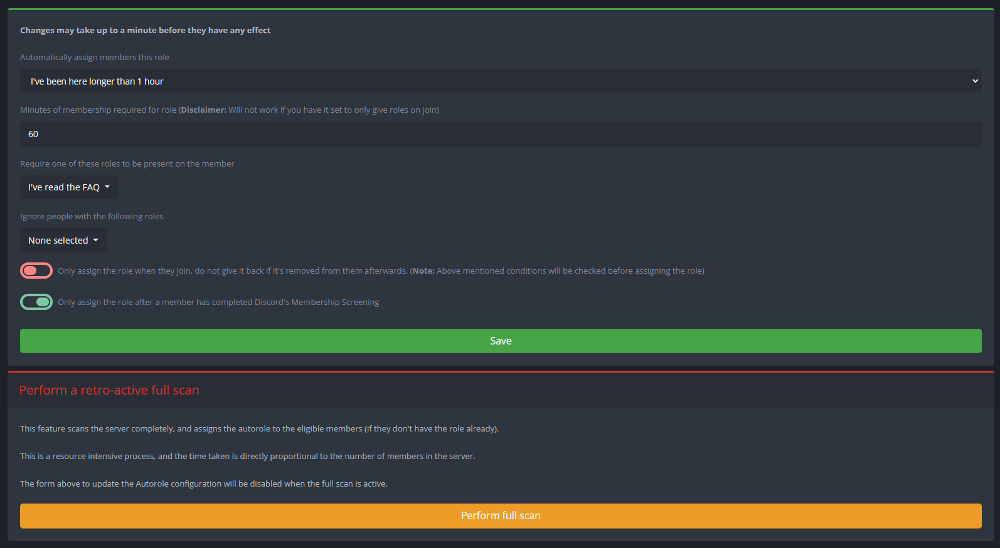

# Autorole


Make sure that the bot has permission to manage roles **and** that the role the bot is assigning is below the highest role the bot has.&#x20;



**Warning:** Be careful when using autorole to automatically give new members roles. Discord's in-built new member verification only works on members with no roles, rendering it useless if members are given roles right after they join.&#x20;


The different parameters you can set up on this site are:

* **Automatically assign members this role**: Select the role that you want to bot to auto assign (only one role can be auto assigned).
* **Minutes of membership required for role**: Requires that a member must be on the server for `x` minutes before assigning the role.&#x20;
* **Require one of these roles to be present on the member**: If a person does not have one of the following roles on them they will not be given a role.&#x20;
* **Ignore people with the following roles**: If a person has one of the following roles on them they will not be given a role.
* **Only assign role when they join, do not give it back if it's removed from them afterwards**: Only assign the role to them once when they joined. If they lose the role sometime after, the bot will not give it back to them. Note that this means what it says - if this option is unticked and you remove this role manually from someone, it will be given back automatically.
* **Only assign the role after a member has completed Discord's Membership Screening**: The autorole will only assign the set role after member has completed the server's Membership Screening.

**Retro-active full scan**\
This feature is only available for premium users and it scans the server completely, assigning the autorole to the eligible members (if they don't have the role already).
