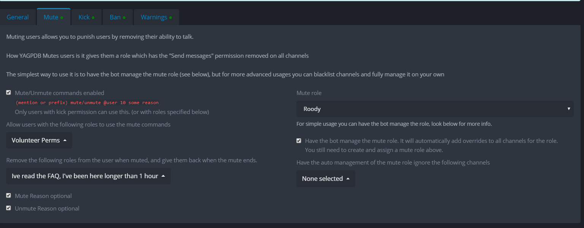

# Moderation

The moderation features YAGPDB provides are:

* **Mod log** that logs all moderation actions
* Generation of a **message log** for all mod action
  * For example: if you use the `-ban` command, the bot will also log the last 100 messages in the channel the command was executed, including deleted messages.
* **Kick and ban commands**
  * You can use the default message or create your own.
  * You can delete the last 100 messages of the user when they get kicked/banned.
* **Mute command**
  * Assigns the mute role for a temporary duration.
  * You can enable to bot to set up the permissions for the mute role but you will still have to create the role yourself.
  * If you have any roles that conflict with the mute role, you can select roles to be removed when the mute is assigned and will be given back to them after the mute is done.&#x20;
* **Clean/Clear command**
  * Removes last x messages with optional filtering arguments available. See below for more details and examples.
* **Warnings**
  * Assign a warning to a user, trackable through the bot.&#x20;

There is also an auto-moderation feature as well.


[automoderator-v2.md](automoderator-v2.md)


## Clean/Clear Syntax and examples

&#x20;**Syntax**`-clean (Optional -ma [time]) (Optional -minage [time]) (Optional -nopin) (Optional -r "word") (Optional -i) (optional -im) (Optional -a) (Optional -to) (Optional @user) (num)`&#x20;

**Examples**\
****`-clean 100` \
Cleans 100 most recent messages.\
\
`-clean -ma 2h 100` \
Cleans 100 messages sent in the last 2 hours.\
\
`-clean -r pineapple 100`\
Cleans 100 messages containing pineapple.\
\
`-clean -r pineapple -i 100` \
Cleans 100 messages containing pineapple, and ignoring case sensitivity.\
\
`-clean -r pineapple -im 100`\
Cleans  100 messages _not_ containing pineapple.\
\
`-clean 100 -to 268748318664949760`\
Cleans 100 messages until it reaches a message with an ID less than or equal to`268748318664949760`.\
\
`-clean 100 -a`\
Cleans 100 messages that contain attachments.\
\
`-clean @user 100` \
Cleans 100 messages sent by @user.\
\
`-clean -ma 5h -r pineapple -i @user 100` \
Cleans 100 messages sent by @user in the last 5 hours containing pineapple, ignoring case sensitivity.\
\
`-clean -ma 30m -minage 10m -nopin 100`\
Cleans 100 messages with a maximum age of 30 minutes and a minimum age of 10 minutes, ignoring pinned messages.
